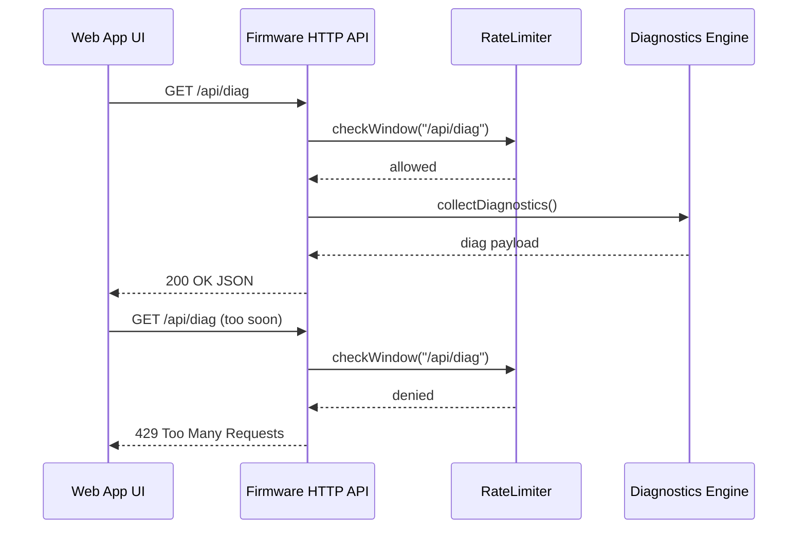
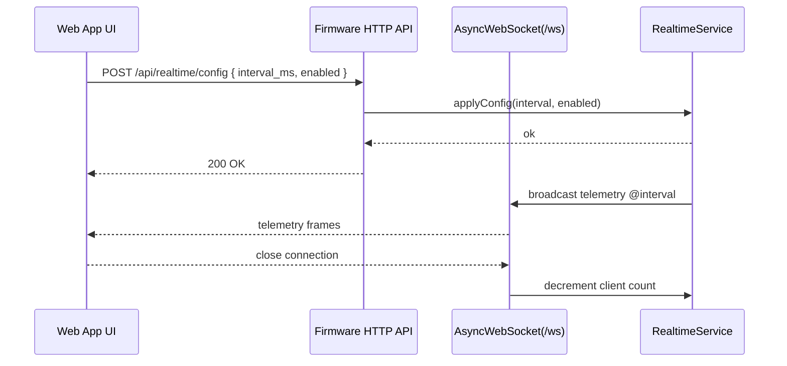
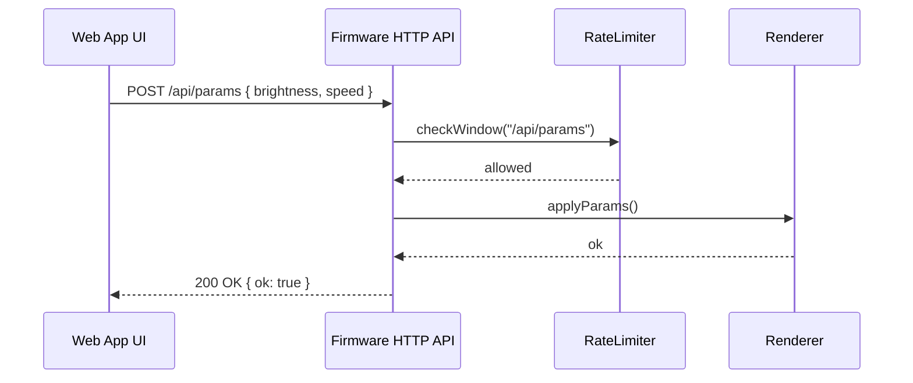

# Sequence Diagrams

The following Mermaid diagrams illustrate key runtime flows across HTTP and WebSocket interactions.

## Diagnostics Request Flow

## Realtime Toggle and Broadcast

## Parameter Update Flow

