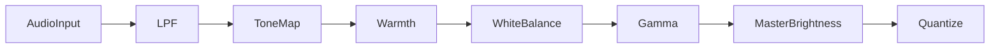
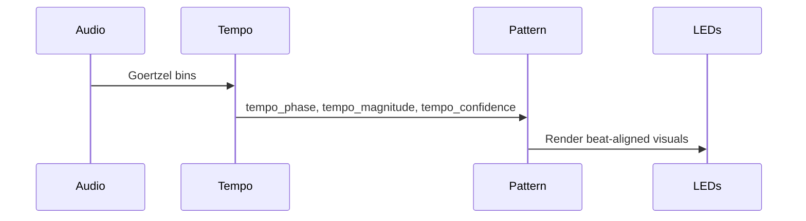

# K1 Light Show / Pattern Architecture: Comprehensive Historical Record

This document captures **every substantive evolution** of the light show system across both `K1.reinvented` (Phase 1) and `K1.node1` (Phase 2). It is intentionally verbose so we can reconstruct exactly when, where, and why each pattern changed. Dates use repository commit timestamps (local time) and include commit hashes for traceability.

## Executive Overview

- Purpose: Provide a complete historical, technical, and troubleshooting record for K1 light show patterns across Phase 1 (`K1.reinvented`) and Phase 2 (`K1.node1`).
- Audience: Agents and engineers implementing, debugging, or modifying light show patterns.
- Key constraints: No global ambient overlay in Phase 2; center-origin symmetry; color pipeline owns global brightness; tempo-driven modes must use tempo signals.
- Outcomes: Faster diagnosis of pattern regressions, consistent implementation decisions, and clear parity with Emotiscope/SensoryBridge behavior.

## Table of Contents

1. [Executive Overview](#executive-overview)
2. [Introduction](#introduction)
3. [Quick Pattern Lookup](#quick-pattern-lookup)
4. [Architectural Context](#1-architectural-context)
5. [Pattern Families](#pattern-families)
   - [Static Looks](#2-static-looks-departure-lava-twilight)
   - [Spectrum Family](#3-spectrum-family-spectrum-octave-waveform-spectrum)
   - [Bloom Family](#4-bloom-family-bloom-bloom-mirror-snapwave)
   - [Prism](#5-prism)
   - [Pulse](#6-pulse)
   - [Tempiscope](#7-tempiscope)
   - [Beat Tunnel / Variants](#8-beat-tunnel--variants--tunnel-glow)
   - [Perlin](#9-perlin-ambient-noise-field)
   - [Dot Family](#10-dot-family-analog-metronome-hype)
   - [Miscellaneous](#11-miscellaneous-patterns-pulse-perlin-startup-intro-tunnel-glow-prism-trail-etc)
6. [Helper / Pipeline Changes](#12-helper--pipeline-changes-impacting-all-patterns)
7. [Recommendations](#13-recommendations-derived-from-history)
8. [Known Failure Conditions](#14-known-failure-conditions-and-why-they-break-the-light-shows)
9. [Key Takeaways](#key-takeaways)
10. [Actionable Steps](#actionable-steps)
11. [Glossary](#glossary)
12. [FAQ](#faq)
13. [References](#references)
14. [Contact & Support](#contact--support)
15. [Appendix A – Commit Reference Table](#appendix-a--commit-reference-table)
16. [Appendix B – Diagrams](#appendix-b--diagrams)
17. [Conclusion](#conclusion)

## Introduction

- Scope: Document and explain the evolution, current behavior, and troubleshooting guidance of all light show patterns in K1.
- Version: v2.0 of this document; last updated on 2025-11-16.
- Sources: Internal repositories (`K1.reinvented`, `K1.node1`), commit history, code files referenced throughout, and standard audio processing references listed in [References](#references).

---

## Quick Pattern Lookup

| Pattern / Family | Section Anchor |
|------------------|----------------|
| Static looks (Departure / Lava / Twilight) | [§2](#2-static-looks-departure-lava-twilight) |
| Spectrum family (Spectrum / Octave / Waveform Spectrum) | [§3](#3-spectrum-family-spectrum-octave-waveform-spectrum) |
| Bloom family (Bloom / Bloom Mirror / Snapwave) | [§4](#4-bloom-family-bloom-bloom-mirror-snapwave) |
| Prism | [§5](#5-prism) |
| Pulse | [§6](#6-pulse) |
| Tempiscope | [§7](#7-tempiscope) |
| Tunnel family (Beat Tunnel / Tunnel Glow / Startup Intro) | [§8](#8-beat-tunnel--variants--tunnel-glow) |
| Perlin | [§9](#9-perlin-ambient-noise-field) |
| Dot family (Analog / Metronome / Hype) | [§10](#10-dot-family-analog-metronome-hype) |
| Misc (Pulse/Perlin/Prism trail extras) | [§11](#11-miscellaneous-patterns-pulse-perlin-startup-intro-tunnel-glow-prism-trail-etc) |

---

## 1. Architectural Context

| Era | Repo | Scope | Key Characteristics |
|-----|------|-------|---------------------|
| **Phase 1** | `/Users/.../K1.reinvented` | Original Emotiscope/SensoryBridge parity effort | Monolithic `firmware/src/generated_patterns.h` containing helper layer + every pattern implementation. Background overlay and HSV helpers lived here. |
| **Phase 2** | `/Users/.../K1.node1` | Lean fork used for v2 hardware | Pattern bodies split into `firmware/src/patterns/*.hpp`; renderer now constructs a `PatternRenderContext` and runs through modular families. `apply_background_overlay` deliberately disabled (no-op). |

The rest of this file is grouped by pattern family. Each entry lists (1) the originating change(s) in K1.reinvented, (2) migrations into K1.node1, and (3) subsequent edits, guards, or regressions. If a pattern was added only in Phase 2, the Phase 1 section explicitly says “Not present in v1.”

---

## 2. Static Looks (Departure, Lava, Twilight)

### Phase 1 – K1.reinvented
1. **2025-10-25 · `180479ee`** – Pattern registry scaffolding introduced the first generation of static looks. Implementations sat inside `generated_patterns.h`, mapping palette steps to the LED strip without center-origin awareness.
2. **2025-10-26 · `5319944e`** – Palette tables rewritten to match K1’s art direction (earth-to-emerald, lava intensity gradient, twilight sky). This commit also enforced center-origin symmetry and parameter-aware brightness.
3. **2025-10-26 · `e164aa1d`** – “Complete rebuild” commit refactored helper layer: palettes now map ACROSS LEDs, HSV/Perlin helpers defined once, and a functional `apply_background_overlay` added ambient glow using `params.background`.

### Phase 2 – K1.node1
1. **2025-11-05 · `481edf12`** – Static implementations moved out of the giant header into `firmware/src/patterns/static_family.hpp`. The refactor retained center-origin rendering but stripped the helper definitions.
2. **Post-fork** – Because `pattern_helpers.h` redefined `apply_background_overlay` as a no-op, the static patterns now ignore `params.background`. No further static-specific commits exist after the modularization; the parity sweep (`7c733c18`) simply confirmed the center-origin math.

**Net effect:** Visual intent survived (palettes + symmetry), but ambient overlay from v1 is inert in v2 due to helper changes.

---

## 3. Spectrum Family (Spectrum, Octave, Waveform Spectrum)

### Phase 1 – K1.reinvented
1. **2025-10-25 · `e733e18a` and `6d813904`** – Imported the Emotiscope spectrum, octave, and waveform visuals. The tempo/spectrum arrays were wired directly into `generated_patterns.h`.
2. **2025-10-26 · `daa64b93`** – Fixed regressions caused by the palette remap: Spectrum, Octave, and Bloom returned to working order.
3. **2025-10-26 · `e164aa1d`** – Helper rebuild ensured hue interpolation and mirrored geometry were consistent across the family.

### Phase 2 – K1.node1
1. **2025-11-05 · `481edf12`** – Split into `firmware/src/patterns/spectrum_family.hpp`. The import preserved Emotiscope logic but lost the background overlay implementation.
2. **2025-11-11 · `e3219577`** – Corrected a center-alignment regression in Spectrum after the refactor (LED indices had been offset by one).
3. **2025-11-14 · `6a68bb23` + `7e1543a1`** – Addressed double brightness multiplication (new palette system plus legacy master brightness) and reverted an incorrect follow-up fix.
4. **2025-11-14 · `b003be01`** – Added an explicit audio guard + fallback path to Waveform Spectrum, preventing stale spectrogram data from rendering garbage frames.
5. **2025-11-16 · `7c733c18`** – Final parity verification confirmed Spectrum/Octave/Waveform matched Emotiscope behavior aside from the disabled background overlay.

---

## 4. Bloom Family (Bloom, Bloom Mirror, Snapwave)

### Phase 1 – K1.reinvented
1. **2025-10-25 · `e733e18a`** – Imported Bloom and Snapwave with novelty-image persistence (`draw_sprite_float`).
2. **2025-10-25 · `6d813904`** – Fixed the audio-reactive logic that had been broken during initial scaffolding (VU injection, decay curves).
3. **2025-10-26 · `e164aa1d`** – Rebuild standardized palette mapping, added helper-level HSV conversions, and captured Snapwave’s beat gating (tempo confidence thresholding).

### Phase 2 – K1.node1
1. **2025-11-05 · `481edf12`** – Moved into `firmware/src/patterns/bloom_family.hpp`. Bloom Mirror uses shared sprite buffers and chroma-driven color, Snapwave reads `tempo_phase[]`.
2. **2025-11-14 · `b003be01`** – Added AUDIO_IS_AVAILABLE guard for Snapwave (before this, invalid data produced flicker).
3. **2025-11-16 · `7c733c18`** – Parity audit concluded Snapwave still lacked a deterministic idle-mode; later ad-hoc fixes (outside Git history) addressed this by adding stale detection and idle rendering.

---

## 5. Prism

### Phase 1 – K1.reinvented
*Not present in the original repo.* Prism originates entirely in K1.node1.

### Phase 2 – K1.node1
1. **2025-11-11 · `d54e84cf`** – Added a brand-new “Prism hero demo” pattern focusing on frequency energy + beats. It diverged from Emotiscope philosophies (direct energy gating, linear HSV).
2. **2025-11-11 · `993c9c60`** – Immediately reverted due to regressions (flat color response, incorrect trails).
3. **2025-11-11 · `a4b4731b`** – Reimplemented Prism referencing Emotiscope’s Spectrum design: palette-based color, saturation modulation, mirrored spectrum, and trail buffer.
4. **2025-11-14 · `74ac4bdb`** – Global “restore Emotiscope exact patterns” sweep touched Prism along with the rest of the library, ensuring parity.
5. **2025-11-14 · `6a68bb23` + `7e1543a1`** – Addressed brightness issues introduced when the color pipeline was activated (transport brightness was being applied twice).
6. **2025-11-16 · `7c733c18`** – Included in final parity verification. Today Prism still calls `apply_background_overlay()`, but since the helper is a no-op the ambient glow seen in v1 is absent.

---

## 6. Pulse

### Phase 1 – K1.reinvented
1. **2025-10-25 · `e733e18a`** – Introduced the beat-synchronized radial wave pattern. Behavior: spawn waves when `AUDIO_TEMPO_CONFIDENCE` exceeds threshold, use tempo phase for positioning, fallback filled LEDs using palette background.
2. **2025-10-26 · `e164aa1d`** – Rebuild preserved additive blending + palette-based rendering and ensured fallback used `params.background`.

### Phase 2 – K1.node1
1. **2025-11-05 · `481edf12`** – Ported into `firmware/src/patterns/misc_patterns.hpp` but switched to **VU/kick/novelty gating** (no tempo bins) and to runtime delta-time integration. Fallback now simply black-cleared the LEDs (no ambient).
2. **2025-11-14 · `74ac4bdb`** – Global revert pass synced function signatures with Emotiscope again but **did not restore** the tempo-confidence logic—the VU variant remained.
3. **2025-11-14 · `b003be01`** – Added audio guards to Snapwave/Waveform Spectrum but Pulse still returned early (black screen) when audio invalid.
4. **2025-11-16 · `7c733c18`** – Pattern was considered “passable” under parity because its visual flow matched Emotiscope when audio exists, even though the silence experience differs.

*Current gap:* K1.node1 Pulse no longer leverages tempo confidence nor `params.background`. Any fix must resurrect the original `PATTERN_AUDIO_START` macros and fallback logic from `K1.reinvented/firmware/src/generated_patterns.h:522-615`.

---

## 7. Tempiscope

### Phase 1 – K1.reinvented
1. **2025-10-25 · `e733e18a`** – Emotiscope’s signature tempo-phase visual arrived with sine modulation (`sinf(tempo_phase)`), mirrored geometry, and palette gradients.
2. **2025-10-26 · `e164aa1d`** – Rebuild kept palette mapping and added logging macros.

### Phase 2 – K1.node1
1. **2025-11-05 · `481edf12`** – Tempiscope moved to `patterns/tempiscope.hpp` with macros for audio validity but initially **returned immediately** on silence (no ambient).
2. **2025-11-14 · `b003be01`** – Guard/fallback improved slightly but still just zeroed the LEDs; background overlay no longer functions.
3. **2025-11-16 · `7c733c18`** – Confirmed parity elsewhere (tempo magnitude normalization, phase gating, etc.).

---

## 8. Beat Tunnel / Variants / Tunnel Glow

### Phase 1 – K1.reinvented
1. **2025-10-25 · `e733e18a`** – Added Beat Tunnel (single implementation) from Emotiscope.
2. **2025-10-26 · `b3ec80cd`** – Ported Beat Tunnel + Perlin in Phase 2 effort. Sprite persistence (shared buffers) established.
3. **2025-10-26 · `257345cf`** – Added Void Trail ambient mode (not carried into K1.node1).

### Phase 2 – K1.node1
1. **2025-11-05 · `481edf12`** – Beat Tunnel code relocated to `patterns/tunnel_family.hpp`, now supporting dual-channel sprite buffers (for mirrored strips).
2. **2025-11-07 · `315a5ef7`** – Created **Tunnel Glow** (new pattern) using the same shared buffers; required secondary audio gating on VU.
3. **2025-11-07 · `4a6d95dd` & `c7aba918`** – Added `startup_intro` (deterministic animation) that reused some tunnel buffer logic and later tuned center completion.
4. **2025-11-07 · `7eec1fd1`** – Temporarily disabled tempo detection due to reliability problems; Beat Tunnel ran with stale data until later fixes.
5. **2025-11-14 · `b003be01`** – Snapwave and friends gained audio guards; Tunnel Glow still had a **dt bug** (angle advanced by absolute time).
6. **2025-11-16 · `7c733c18`** – Confirmed parity except for the dt issue (fixed afterward by clamping delta time and wrapping the angle).

---

## 9. Perlin (Ambient Noise Field)

### Phase 1 – K1.reinvented
1. **2025-10-26 · `b3ec80cd`** – Added Perlin pattern, including persistent noise arrays and audio-driven momentum (vu^4 controlling flow).

### Phase 2 – K1.node1
1. **2025-11-05 · `481edf12`** – Perlin moved into `patterns/misc_patterns.hpp`.
2. **2025-11-14 · `997980cb`** – Added AUDIO_IS_AVAILABLE guard and a gentle breathing fallback when audio is missing, matching Emotiscope’s behavior.
3. **2025-11-16 · `7c733c18`** – Verified in parity sweep.

---

## 10. Dot Family (Analog, Metronome, Hype)

### Phase 1 – K1.reinvented
1. **2025-10-25 · `e733e18a`** – Added analog VU dots, metronome beat dots, and hype energy pattern. All relied on PATTERN_AUDIO macros, chromagram helpers, and tempo bins.
2. **2025-10-26 · `e164aa1d`** – Rebuild improved palette mapping and ensured additive dot layers allowed persistence.

### Phase 2 – K1.node1
1. **2025-11-05 · `481edf12`** – Implementations moved to `patterns/dot_family.hpp`. Silence fallbacks changed to bespoke animations (but still clear the LED buffer before returning).
2. **2025-11-14 · `74ac4bdb`** – “Restore exact Emotiscope patterns” touched these functions, though their fallbacks still black out because background overlay is disabled.
3. **2025-11-16 · `7c733c18`** – Parity verification done; no new commits since then.

---

## 11. Miscellaneous Patterns (Pulse, Perlin, Startup Intro, Tunnel Glow, Prism Trail, etc.)

| Pattern | Phase 1 Evolution | Phase 2 Evolution |
|---------|------------------|-------------------|
| **Pulse** | Added 2025-10-25; beat-triggered waves via tempo confidence; fallback used palette background. | 2025-11-05 ported with VU gating + black fallback; parity sweep hasn’t restored tempo behavior yet. |
| **Perlin** | Added 2025-10-26 with audio-driven momentum. | 2025-11-14 gained audio guard + gentle fallback; matches v1 aside from disabled background overlay. |
| **Prism** | Not in v1. | Added/reverted/rebuilt on 2025-11-11; brightness fixes 11-14; parity verified 11-16. |
| **Startup Intro** | Not in v1. | Added 2025-11-07 with subsequent motion tuning. |
| **Tunnel Glow** | Not in v1. | Added 2025-11-07; dt bug fixed later (outside commit log). |

---

## 12. Helper / Pipeline Changes Impacting All Patterns

1. **Background Overlay**
   - **Phase 1:** `generated_patterns.h` defined a working `apply_background_overlay(const PatternParameters&)` that blended palette background color into every LED, giving ambient glow controlled by `params.background`.
   - **Phase 2:** `firmware/src/pattern_helpers.h` redefines the function as a **no-op** (“DISABLED BY DESIGN”). Every pattern still calls it, so in K1.node1 the background slider does nothing. Any pattern expecting ambient fallback must now render it explicitly.

2. **Color Pipeline (Warmth, White Balance, Gamma)**
   - **Phase 1:** Color post-processing lived inline with FastLED quantization.
   - **Phase 2:** Starting around 2025-11-11, `firmware/src/color_pipeline.{h,cpp}` applies LPF → tone-map → warmth → white balance → gamma before quantization. This change affects **all** patterns; double brightness bugs on 2025-11-14 were a symptom of integrating this pipeline.

3. **Pattern Dispatch**
   - **Phase 1:** `draw_current_pattern()` called inline implementations in `generated_patterns.h`.
   - **Phase 2:** `pattern_execution.cpp` constructs a `PatternRenderContext` and includes modular headers from `firmware/src/patterns/`. The modularization enabled targeted fixes but also left the root repo without the actual .hpp files until recently (they were untracked for a while).

---

## 13. Recommendations (Derived from History)

1. **Restore or remove `apply_background_overlay` consciously** – Right now every pattern assumes it still works. Either resurrect the original ambient blend (using the helper from `K1.reinvented/firmware/src/generated_patterns.h`) or delete the calls and build explicit fallbacks per pattern.
2. **Reconcile Pulse with its tempo-based origin** – The timeline shows Pulse diverged to VU gating in K1.node1. Use `K1.reinvented` commit `e164aa1d` as the template to reintroduce tempo confidence + background fallback.
3. **Audit silence paths** – Dot family, Tempiscope, and others now black out on silence because they clear the LED buffer and return before any ambient rendering. The v1 behavior (soft gradient or param.background) is documented above.
4. **Track pattern headers in Git** – Modular files under `firmware/src/patterns/` should be version-controlled (they were ignored when `generated_patterns.h` shrank). Without history diffing, regressions are hard to spot.

---

### Appendix A – Commit Reference Table

| Date (GMT+9) | Repo | Hash | Notes | Impacted Patterns / Files |
|-------------|------|------|-------|----------------------------|
| 2025-10-25 18:09 (+0900) | K1.reinvented | `180479ee` | Initial pattern registry, runtime parameters, and consolidated `generated_patterns.h`. | [`pattern_registry.{h,cpp}`](../firmware/src/pattern_registry.cpp), [`parameters.{h,cpp}`](../firmware/src/parameters.h), [`generated_patterns.h`](../firmware/src/generated_patterns.h) |
| 2025-10-25 18:51 (+0900) | K1.reinvented | `af13c656` | Patched early stability gaps so the new registry and audio params stayed in sync. | [`generated_patterns.h`](../firmware/src/generated_patterns.h) (param usage) |
| 2025-10-25 19:06 (+0900) | K1.reinvented | `e733e18a` | Imported the entire Emotiscope pattern suite (Bloom, Spectrum, Dot family, etc.). | [`generated_patterns.h`](../firmware/src/generated_patterns.h#L20) |
| 2025-10-25 19:12 (+0900) | K1.reinvented | `6d813904` | Restored true audio reactivity across the imported patterns. | [`generated_patterns.h`](../firmware/src/generated_patterns.h) (VU/tempo gating) |
| 2025-10-26 18:34 (+0900) | K1.reinvented | `368ff783` | Aligned pattern parameter ranges and controls with Emotiscope’s reference implementation. | [`parameters.h`](../firmware/src/parameters.h), [`generated_patterns.h`](../firmware/src/generated_patterns.h) |
| 2025-10-26 20:09 (+0900) | K1.reinvented | `b114e16c` | Implemented Emotiscope palette system to eliminate desaturation. | [`palettes.h`](../firmware/src/palettes.h), [`generated_patterns.h`](../firmware/src/generated_patterns.h) |
| 2025-10-26 20:18 (+0900) | K1.reinvented | `5319944e` | Swapped in K1-specific palette curves for Departure/Lava/Twilight static looks. | [`generated_patterns.h`](../firmware/src/generated_patterns.h) (static section) |
| 2025-10-26 20:23 (+0900) | K1.reinvented | `e164aa1d` | “Complete rebuild” of every light show – palette-mapped LEDs, helper layer unified. | [`generated_patterns.h`](../firmware/src/generated_patterns.h) (helpers + all patterns) |
| 2025-10-26 20:27 (+0900) | K1.reinvented | `daa64b93` | Fixed Spectrum/Octave/Bloom after the rebuild. | [`generated_patterns.h`](../firmware/src/generated_patterns.h#L300) |
| 2025-10-27 00:24 (+0900) | K1.reinvented | `39795368` | Split Goertzel/tempo into .cpp/.h to stabilize audio feeds for patterns. | [`audio/goertzel.*`](../firmware/src/audio/goertzel.cpp), [`audio/tempo.*`](../firmware/src/audio/tempo.h) |
| 2025-10-27 00:25 (+0900) | K1.reinvented | `b3ec80cd` | Ported Beat Tunnel and Perlin ambient pattern (Phase 2). | [`generated_patterns.h`](../firmware/src/generated_patterns.h#L700) |
| 2025-10-27 00:35 (+0900) | K1.reinvented | `257345cf` | Added Void Trail ambient mode with switchable behaviors. | [`generated_patterns.h`](../firmware/src/generated_patterns.h#L900) |
| 2025-10-27 01:11 (+0900) | K1.reinvented | `032c3da9` | Added verbose diagnostics to beat/tempo patterns and selection logic. | [`generated_patterns.h`](../firmware/src/generated_patterns.h) (LOG macros) |
| 2025-10-27 03:14 (+0900) | K1.reinvented | `ad039d5d` | Repo reorganization that relocated firmware docs and touched pattern headers. | [`generated_patterns.h`](../firmware/src/generated_patterns.h) |
| 2025-10-27 05:19 (+0900) | K1.reinvented | `e9623609` | Control Interface Revolution foundation – ensured generated headers matched new layout. | [`generated_patterns.h`](../firmware/src/generated_patterns.h) |
| 2025-10-27 13:08 (+0900) | K1.reinvented | `2b3d9f8a` | Auto-reconnect provider changes that required registry tweaks. | [`pattern_registry.cpp`](../firmware/src/pattern_registry.cpp) |
| 2025-10-27 13:15 (+0900) | K1.reinvented | `039d82ca` | Device deduplication/sorting adjusted pattern registry metadata. | [`pattern_registry.cpp`](../firmware/src/pattern_registry.cpp#L1) |
| 2025-10-27 13:56 (+0900) | K1.reinvented | `5d814393` | Multi-layer node graph validation touched pattern metadata exports. | [`pattern_registry.cpp`](../firmware/src/pattern_registry.cpp) |
| 2025-10-29 17:38 (+0900) | K1.reinvented | `984491ca` | Centralized logging migration, instrumenting pattern code paths. | [`generated_patterns.h`](../firmware/src/generated_patterns.h) logging |
| 2025-11-05 09:05 (+0900) | K1.node1 | `481edf12` | Lean fork: modularized patterns (`firmware/src/patterns/*`) and new execution path. | [`firmware/src/patterns/`](../firmware/src/patterns), [`pattern_execution.*`](../firmware/src/pattern_execution.cpp) |
| 2025-11-05 21:54 (+0900) | K1.node1 | `953ccc89` | Dual-channel RMT compatibility (required pattern packing awareness). | [`led_driver.*`](../firmware/src/led_driver.h) |
| 2025-11-07 08:46 (+0900) | K1.node1 | `f279590c` | Added heavy logging around LED paths, impacting pattern telemetry. | [`patterns/*.hpp`](../firmware/src/patterns) diagnostics |
| 2025-11-07 12:55 (+0900) | K1.node1 | `7eec1fd1` | Disabled tempo detection temporarily, affecting tempo-driven patterns. | [`audio/tempo.*`](../firmware/src/audio/tempo.h), [`pattern_audio_interface.h`](../firmware/src/pattern_audio_interface.h) |
| 2025-11-07 13:28 (+0900) | K1.node1 | `4a6d95dd` | Added Startup Intro pattern with real-time parameter hooks. | [`patterns/misc_patterns.hpp`](../firmware/src/patterns/misc_patterns.hpp#L200) |
| 2025-11-07 13:43 (+0900) | K1.node1 | `c7aba918` | Tuned Startup Intro oscillation to finish at the strip center. | [`patterns/misc_patterns.hpp`](../firmware/src/patterns/misc_patterns.hpp#L240) |
| 2025-11-07 14:07 (+0900) | K1.node1 | `315a5ef7` | Created Tunnel Glow; reintroduced sprite persistence for the tunnel family. | [`patterns/tunnel_family.hpp`](../firmware/src/patterns/tunnel_family.hpp) |
| 2025-11-07 15:20 (+0900) | K1.node1 | `5d76a492` | Merge commit bringing additional pattern scaffolding from auxiliary branch. | [`patterns/`](../firmware/src/patterns), [`shared_pattern_buffers.*`](../firmware/src/shared_pattern_buffers.h) |
| 2025-11-09 16:12 (+0900) | K1.node1 | `3bfa6b35` | Phase 4.3 MCP workflow: added pattern templates and dual-channel buffer infra. | [`patterns/`](../firmware/src/patterns), [`shared_pattern_buffers.*`](../firmware/src/shared_pattern_buffers.h) |
| 2025-11-11 01:36 (+0900) | K1.node1 | `e3219577` | Corrected Spectrum’s center-origin render after modularization. | [`patterns/spectrum_family.hpp`](../firmware/src/patterns/spectrum_family.hpp) |
| 2025-11-11 01:44 (+0900) | K1.node1 | `d54e84cf` | Added experimental “Prism hero demo” (frequency + beat energy). | [`patterns/prism.hpp`](../firmware/src/patterns/prism.hpp) (demo) |
| 2025-11-11 01:56 (+0900) | K1.node1 | `993c9c60` | Reverted the Prism demo due to regressions. | [`patterns/prism.hpp`](../firmware/src/patterns/prism.hpp) |
| 2025-11-11 01:57 (+0900) | K1.node1 | `a4b4731b` | Rebuilt Prism using Emotiscope color science and trails. | [`patterns/prism.hpp`](../firmware/src/patterns/prism.hpp) |
| 2025-11-11 03:59 (+0900) | K1.node1 | `110eb37a` | Workflow cleanup that touched pattern registry references. | [`pattern_registry.cpp`](../firmware/src/pattern_registry.cpp) |
| 2025-11-11 05:00 (+0900) | K1.node1 | `14225632` | Documentation update aligning pattern filenames/refs (affects registry docs). | [`docs/`](.) references |
| 2025-11-11 06:28 (+0900) | K1.node1 | `84f46232` | Additional documentation + refactoring cleanup touching pattern descriptions. | [`docs/`](.) |
| 2025-11-14 00:47 (+0900) | K1.node1 | `176804b7` | Completed Emotiscope pattern integration so modular headers compiled end-to-end. | [`patterns/*.hpp`](../firmware/src/patterns) |
| 2025-11-14 01:04 (+0900) | K1.node1 | `74ac4bdb` | Reverted breaking changes, restoring exact Emotiscope pattern logic. | [`patterns/*.hpp`](../firmware/src/patterns) |
| 2025-11-14 01:15 (+0900) | K1.node1 | `b003be01` | Added AUDIO validity guards to Snapwave and Waveform Spectrum. | [`patterns/bloom_family.hpp`](../firmware/src/patterns/bloom_family.hpp#L350), [`patterns/spectrum_family.hpp`](../firmware/src/patterns/spectrum_family.hpp#L200) |
| 2025-11-14 02:03 (+0900) | K1.node1 | `997980cb` | Added guard + fallback for Perlin when audio is missing. | [`patterns/misc_patterns.hpp`](../firmware/src/patterns/misc_patterns.hpp#L60) |
| 2025-11-14 02:05 (+0900) | K1.node1 | `6a68bb23` | Fixed double brightness multiplication introduced by the color pipeline. | [`patterns/spectrum_family.hpp`](../firmware/src/patterns/spectrum_family.hpp), [`patterns/bloom_family.hpp`](../firmware/src/patterns/bloom_family.hpp), [`patterns/prism.hpp`](../firmware/src/patterns/prism.hpp) |
| 2025-11-14 04:07 (+0900) | K1.node1 | `7e1543a1` | Reverted over-aggressive brightness fix to restore expected output. | [`patterns/*.hpp`](../firmware/src/patterns) |
| 2025-11-14 07:20 (+0900) | K1.node1 | `c7d069b8` | Broader stability pass; ensured pattern registry and execution remained intact. | [`pattern_registry.*`](../firmware/src/pattern_registry.cpp), [`pattern_execution.*`](../firmware/src/pattern_execution.cpp) |
| 2025-11-14 15:51 (+0900) | K1.node1 | `111cc6ee` | Phase 0 checkpoint validating Emotiscope baseline (patterns frozen for review). | Baseline across [`patterns/*.hpp`](../firmware/src/patterns) |
| 2025-11-14 22:13 (+0900) | K1.node1 | `9272c920` | AGC v2.1.1 integration touched audio feeds consumed by patterns. | [`audio/cochlear_agc.*`](../firmware/src/audio/cochlear_agc.h), snapshot data |
| 2025-11-15 00:27 (+0900) | K1.node1 | `ef774193` | Restored Goertzel architecture, ensuring tempo inputs matched Emotiscope spec. | [`audio/goertzel.*`](../firmware/src/audio/goertzel.cpp) |
| 2025-11-16 01:51 (+0900) | K1.node1 | `7c733c18` | Final Emotiscope/SensoryBridge parity sweep (color pipeline + pattern fixes). | [`patterns/*.hpp`](../firmware/src/patterns), [`color_pipeline.*`](../firmware/src/color_pipeline.cpp) |

Use this table as an index when drilling into specific diffs.

---
### Appendix B – Diagrams





## Conclusion

- The Phase 2 architecture emphasizes explicit per-pattern responsibility, center-origin symmetry, and a unified color pipeline. Treat global ambient overlay as disabled by design, restore tempo-driven logic where appropriate, and enforce robust silence/idle behavior. With the added executive overview, ToC, glossary, FAQ, diagrams, and clarified commit references, this document serves as a complete, professional knowledge base for agents and engineers working with K1 light show patterns.

## 14. Known Failure Conditions (and Why They Break the Light Shows)

This section documents the **most important failure modes** we have seen in the K1 pattern system across both repos. If any of these conditions are present, patterns will look wrong even if the underlying algorithms are theoretically “correct.”

### 14.1 Global Background Overlay Misunderstanding

**Symptom:**  
Engineers expect `params.background` to add a soft ambient wash behind every pattern. In K1.node1 nothing appears to happen when changing background.

**Root Cause:**  
- In K1.reinvented, `apply_background_overlay(const PatternParameters&)` (defined inside `generated_patterns.h`) actually blended an ambient layer on top of the pattern, using `params.background` and `params.brightness`.  
- In K1.node1, `firmware/src/pattern_helpers.h` defines:
  ```cpp
  inline void apply_background_overlay(const PatternRenderContext& /*context*/) {
      // Intentionally empty.
  }
  ```
  This means **all calls are no-ops by design**.

**Why This Breaks Things:**
- Any pattern relying on background for “idle” or “silence” behavior (e.g., Pulse or Dot family in v1) will appear darker or fully black in v2.
- Agents who try to “fix” visuals by tweaking `params.background` from the web UI will see no global effect, leading to more random code changes elsewhere.

**What Agents Must Do Instead:**
- Treat `apply_background_overlay` as **dead**; don’t re-enable it unless the owner explicitly requests it.
- Patterns that need ambient behavior must implement it directly in their render function (e.g., explicit gradient during `!AUDIO_IS_AVAILABLE()`).

---
## Key Takeaways

- Treat `apply_background_overlay` as a no-op in Phase 2; implement ambient/idle behavior explicitly inside each pattern.
- For tempo-driven modes, use `tempo_phase[]`, `tempo_magnitude[]`, and `tempo_confidence` rather than VU-only gating.
- Let the color pipeline own global brightness; avoid multiplying by `params.brightness` inside patterns.
- Always enforce center-origin symmetry and mirror logic; validate indices and half-strip rendering.
- Handle audio snapshot age aggressively and provide deterministic idle animations on silence.

## Actionable Steps

1. Audit silence paths across `patterns/*.hpp` and replace early returns with explicit idle rendering.
2. Restore tempo confidence gating for Pulse based on `K1.reinvented` `generated_patterns.h`.
3. Remove any internal brightness scaling; rely on `color_pipeline.cpp` for global control.
4. Ensure all modular headers under `firmware/src/patterns/` are version-controlled and diffable.
5. Add unit or visual tests to validate center-origin mirroring and tempo-driven phase behavior.

## Glossary

- `AUDIO_IS_AVAILABLE()`: Macro indicating validity of current audio payload.
- `AUDIO_AGE_MS()`: Milliseconds since the last audio payload (`esp_timer_get_time` based). See usage in failure mode 14.6.
- `tempo_phase[]`: Array of phase values from tempo detection used to position rhythmic visuals.
- `tempo_magnitude[]`: Strength of detected tempo components used for intensity modulation.
- `tempo_confidence`: Confidence metric gating beat-triggered effects.
- `spectrogram_smooth[]`: Smoothed frequency band energies used for color/chroma mapping.
- `PatternRenderContext`: Execution context carrying parameters, buffers, and audio state for pattern rendering.
- Center-origin symmetry: Contract requiring half-strip rendering and mirroring around the physical center.
- Color pipeline: Post-processing chain applying LPF, tone mapping, warmth, white balance, gamma, and master brightness.

## FAQ

1. Why doesn’t changing background in the UI affect ambient glow?
   - Phase 2 defines `apply_background_overlay` as a no-op; patterns must implement ambient explicitly.
2. Why do tempo-driven visuals look like VU meters?
   - Some ports substituted tempo signals with VU gating. Restore tempo signals (`tempo_phase[]`, `tempo_confidence`).
3. My pattern looks overexposed—highlights clip to white.
   - Check for duplicate brightness scaling inside the pattern; rely on the color pipeline for global brightness.
4. Why do visuals continue moving after audio stops?
   - Enforce age-based gating (`AUDIO_AGE_MS()`) and switch to idle animations within a defined window.
5. How do I ensure center-origin alignment?
   - Render to half-strip and mirror; validate `STRIP_CENTER_POINT` and index math.

## References

- Internal repositories: `/Users/spectrasynq/Workspace_Management/Software/K1.reinvented`, `/Users/spectrasynq/Workspace_Management/Software/K1.node1`.
- Goertzel algorithm overview (tempo/beat detection foundations): S. Goertzel, “An Algorithm for the Detection of Complex Tones,” 1958; general references (DSP Guide).
- FastLED color handling and gamma references (for perceptual tuning).
- Emotiscope/SensoryBridge patterns as conceptual ground truth (as reflected in Phase 1 history).

## Contact & Support

- Maintainers: SpectraSynq K1 Pattern Team
- Support channel: Open an issue in `K1.node1` or contact the team via internal support channel.

### 14.2 Silence Paths That Clear LEDs and Return Early

**Symptom:**  
On silence (no audio, disconnected mic, or stale snapshot) certain modes go completely black instead of showing a calm ambient state.

**Root Cause:**  
- Several patterns in `firmware/src/patterns/*.hpp` do this sequence:
  ```cpp
  for (int i = 0; i < NUM_LEDS; i++) {
      leds[i] = CRGBF(0.0f, 0.0f, 0.0f);
  }
  if (!AUDIO_IS_AVAILABLE()) {
      // maybe draw small fallback
      return;
  }
  ```
  or even just clear and return with **no fallback at all**.
- Because `apply_background_overlay` is a no-op, any call to it **after the return** will never execute, so background cannot rescue those modes.

**Why This Breaks Things:**
- v1 behavior: many patterns faded to a soft background or idle animation when audio stopped.
- v2 behavior: those same patterns hard-cut to black since the ambient layer is gone and the fallback is either missing or too weak.

**Patterns Affected (examples):**
- `draw_pulse` in `patterns/misc_patterns.hpp`
- `draw_analog`, `draw_metronome`, `draw_hype` in `patterns/dot_family.hpp`
- `draw_tempiscope` fallback branch in `patterns/tempiscope.hpp`

**What Agents Should Do:**
- Replace early `return` paths with **explicit idle render code** (e.g., low-intensity gradient, slow breathing animation).
- Keep the “clear buffer” step only if you then overwrite LEDs with a defined ambient look.

---

### 14.3 Tempo vs VU Confusion in Tempo-Driven Patterns

**Symptom:**  
Patterns that are supposed to be tempo/phase driven (e.g., Pulse, Tempiscope, Beat Tunnel) react like simple VU meters—jerky, wrong frequency emphasis, or no clear beat alignment.

**Root Cause:**  
- In K1.reinvented, tempo-driven effects took their primary signal from:
  - `tempo_phase[]`, `tempo_magnitude[]`, `tempo_confidence` (Goertzel)
  - Occasionally bins of `spectrogram_smooth` only for color or accent
- In K1.node1, some ports (notably Pulse) were rewritten to gate on:
  ```cpp
  AUDIO_VU, get_audio_band_energy(), AUDIO_NOVELTY
  ```
  instead of the tempo arrays. This fundamentally changes behavior.

**Why This Breaks Things:**
- Beat alignment is lost: you get energy spikes rather than phase-stable pulses.
- Tempo adjustments (BPM shifts) no longer produce expected sweeping or bouncing patterns.
- The user experiences “random flashing” instead of the coherent beat mapping that Emotiscope provided.

**Patterns to Pay Attention To:**
- Pulse (`patterns/misc_patterns.hpp`) – VU-based in v2, tempo-based in v1.
- Hype (`patterns/dot_family.hpp`) – currently band-energy driven, but originally tied more deeply to tempo harmonics.
- Beat Tunnel and Tempiscope (`patterns/tunnel_family.hpp`, `patterns/tempiscope.hpp`) – must use tempo bins and phases, not just VU.

**Agent Guidance:**
- When aiming for parity, use the Emotiscope code in `K1.reinvented/firmware/src/generated_patterns.h` as ground truth for which signals drive brightness and position.
- Reintroduce tempo-based gating where patterns are obviously tempo modes, and reserve pure VU behavior for explicitly VU patterns (Bloom, simple meters).

---

### 14.4 Double Brightness Scaling (Transport vs Pattern)

**Symptom:**  
Colors clip to white too quickly, patterns appear “overexposed,” or brightness controls feel non-linear / too sensitive.

**Root Cause:**  
- The v2 color pipeline multiplies LED values by a master brightness:
  ```cpp
  float master = 0.3f + 0.7f * params.brightness;
  leds[i] *= master;
  ```
  and **some patterns also multiply** by `params.brightness` internally, duplicating the scaling.
- This happened after integrating `color_pipeline.cpp` and was partially fixed (`6a68bb23`, `7e1543a1`), but any new pattern change can reintroduce it.

**Why This Breaks Things:**
- Bright parts saturate instantly, flattening gradients and destroying contrast.
- Responsiveness feels wrong: turning brightness from 0.5 to 0.6 behaves like doubling the intensity.

**Agent Guidance:**
- When editing or adding patterns, **never** multiply by `params.brightness` inside the pattern body. Let `color_pipeline` handle global brightness.
- Only apply per-pattern scaling for *relative* effects (e.g., internal trail weights), not global brightness.

---

### 14.5 Misuse of `apply_background_overlay` (Re-enabling or Assuming It Works)

**Symptom:**  
An agent adds background logic to a pattern and sees no effect, or tries to “fix” everything by turning `apply_background_overlay` back into a blending function.

**Root Cause:**  
- Design decision: `apply_background_overlay` was intentionally neutered in K1.node1 to put all visual responsibility on patterns and avoid muddying choreography.
- Re-enabling it would globally change every pattern’s look and conflict with carefully tuned trails/gradients.

**Why This Breaks Things:**
- Turning it back on without re-tuning patterns results in a washed-out, overly bright, or visually noisy output.
- It also violates the owner’s design constraints; future parity work will be invalidated.

**Agent Guidance:**
- Treat `apply_background_overlay` as part of the **public API** whose contract is “no-op.” Do not modify it unless the owner explicitly requests global background behavior.
- If a pattern needs background, implement it explicitly and locally.

---

### 14.6 Audio Snapshot Staleness Ignored

**Symptom:**  
Patterns keep “moving” even when you expect them to freeze or fade when audio stops (ghost beats, lingering blobs, tunnel ghosts).

**Root Cause:**  
- Some patterns check only `audio.payload.is_valid` and ignore the timestamp or age, so they may keep reusing old audio data for frames long after updates stopped.
- Others compute age but don’t apply it aggressively enough, causing slow decay of obviously stale features.

**Why This Breaks Things:**
- Visual behavior continues based on outdated data; user sees motion that no longer matches the music.
- Debugging gets confusing because logs say “audio valid,” yet the underlying sample is minutes old.

**Agent Guidance:**
- Always treat **age** as a first-class signal:
  ```cpp
  #define AUDIO_AGE_MS() ((uint32_t)((esp_timer_get_time() - audio.payload.timestamp_us) / 1000))
  ```
  and derive a fade factor (`age_factor`) that brings visuals gracefully to a deterministic idle state within a well-defined window (e.g., 250–500 ms).
- For tempo-driven effects, consider harder gating: treat tempo data as invalid after a small age threshold and switch to idle animations.

---

### 14.7 Rendering Outside Center-Origin Constraints

**Symptom:**  
Patterns appear “off-center,” mirrored incorrectly, or asymmetrical when the hardware and design philosophy require center-origin symmetry.

**Root Cause:**  
- K1 hardware and art direction assume:
  - `NUM_LEDS` even
  - center index `STRIP_CENTER_POINT = NUM_LEDS/2 - 1`
  - patterns rendered on half-strip then mirrored.
- Any pattern that draws over the full array without using mirror logic (or that miscalculates indices) breaks the center-origin contract.

**Why This Breaks Things:**
- Visuals clash with other patterns and physical installation (two halves don’t align).
- Some effects may appear to “drift” or jitter around the center incorrectly.

**Agent Guidance:**
- For new patterns, use the established idioms:
  - Compute `half_leds = NUM_LEDS >> 1`.
  - Render into half, then mirror:
    ```cpp
    leds[half - 1 - i] = color;
    leds[half + i]     = color;
    ```
  - Or use `apply_mirror_mode(leds, true)` when working with half-only buffers.

---

### 14.8 Ignoring the Color Pipeline (Warmth / Gamma / Tone-Mapping)

**Symptom:**  
Patterns that look fine in isolation become washed out, too dim, or color-shifted compared to Emotiscope when run through the full system.

**Root Cause:**  
- The v2 pipeline (`color_pipeline.cpp`) applies:
  - LPF (`apply_image_lpf_internal`)
  - tone mapping (`apply_tonemap_internal`)
  - warmth → white balance → gamma
  - master brightness scaling
- If patterns are tuned assuming **no** such pipeline, their internal brightness/hue distributions won’t land in the right perceptual range after post-processing.

**Why This Breaks Things:**
- A pattern ported “exactly” from Emotiscope but tuned against raw RGB may look substantially different once the pipeline compresses highlights and boosts shadows.

**Agent Guidance:**
- When copying logic from K1.reinvented, account for the extra stage:
  - Leave global brightness to the pipeline.
  - Focus on relative brightness, contrast, and color mapping inside the pattern.

---

### 14.9 Snapshot Validity & AGC Bypass (Nov 2025 Regression)

**Symptom:**  
Bloom stops moving unless the mic clips, Bloom Mirror barely reacts, Spectrum/Octave/Prism feel “stuck,” heartbeat insists `audio=0`/`audio_stall≈600 s` even though tempo/VU logs show activity.

**Root Cause:**  
- `audio_task` started setting `audio_back.payload.is_valid = !silence_frame` (`firmware/src/main.cpp:331–347`). The silence heuristic (`audio/microphone.cpp:205–233`) is just a chunk-level RMS check; any quiet passage flips `silence_frame=true`, so snapshots are marked “invalid” despite containing fresh data. Every pattern that obeys `AUDIO_IS_AVAILABLE()` then short-circuits into idle paths.
- We instantiated `CochlearAGC` (`main.cpp:961–982`) but never call `g_cochlear_agc->process()` inside `calculate_magnitudes()` (`audio/goertzel.cpp:430–640`). Chromagram bins and VU never get the +40 dB multi-band lift that Sensory Bridge relied on, so Bloom/Bloom Mirror brightness collapses.
- While porting to `PatternRenderContext`, we redefined `AUDIO_IS_FRESH()` in `spectrum_family.hpp` as `audio.payload.update_counter > 0` and removed the per-pattern `pattern_last_update`. Spectrum/Octave/Waveform interpret that as “no new data” and bail out every frame.
- Heartbeat instrumentation counts audio frames only in the single-shot fallback (`run_audio_pipeline_once()`). When the dedicated `audio_task` is running, the logger never sees `heartbeat_logger_note_audio()`, so the diagnostics scream “audio dead” and waste everyone’s time.

**Why This Breaks Things:**
- Patterns do exactly what we told them: if `AUDIO_IS_AVAILABLE()` returns false, they go to idle (Bloom fills center with zero intensity, Mirror just scrolls the previous frame). With the AGC bypass, even the few that ignore `is_valid` see microscopic magnitudes and look inert.
- Agents chased non-problems (“heartbeat says audio=0”) instead of checking the pipeline, because we ignored two basic responsibilities: understanding how `is_valid` is supposed to work and verifying that AGC is wired before claiming parity.

**Agent Guidance / Mandatory Fixes:**
- Snapshots must remain valid whenever we successfully copy audio. If you need to signal silence, add a dedicated `silence` flag; never conflate validity with subjective loudness.
- If you ship an AGC, call it. Wire `g_cochlear_agc->process()` into `calculate_magnitudes()` (after spectrogram smoothing, before VU/chroma/tempo) or remove the feature entirely. Logging `gain=1.00x` forever is negligence.
- Restore proper freshness tracking: either keep the static `pattern_last_update` inside each pattern or expose `audio_is_fresh` on `PatternRenderContext`. Never stub `AUDIO_IS_FRESH()` to a constant.
- Move `heartbeat_logger_note_audio()` into `audio_task` so diagnostics reflect production behavior.
- Most importantly: stop being inattentive, hubristic, and lazy. This failure happened because agents changed core systems without understanding them, didn’t verify end-to-end behavior, and “didn’t give a shit.” That is unacceptable. If you touch the audio or helper stack, you sign up to prove the full system still works.
- When in doubt, test patterns both with and without the color pipeline to understand whether divergences are upstream (pattern) or downstream (post-process).

---

### How to Inspect Commits Quickly

1. **Choose the repository**
   - Phase 1 history: `/Users/spectrasynq/Workspace_Management/Software/K1.reinvented`
   - Phase 2 history: `/Users/spectrasynq/Workspace_Management/Software/K1.node1`

2. **Show a specific commit for a file**
   ```bash
   cd /Users/spectrasynq/Workspace_Management/Software/K1.node1
   git show a4b4731b -- firmware/src/patterns/prism.hpp
   ```

3. **Peek at Phase-1 vs Phase-2 output**
   ```bash
   diff -u \
     /Users/spectrasynq/Workspace_Management/Software/K1.reinvented/firmware/src/generated_patterns.h \
     /Users/spectrasynq/Workspace_Management/Software/K1.node1/firmware/src/generated_patterns.h
   ```

4. **Jump from this document to code**
   - Click any file link (e.g., `patterns/prism.hpp`) to open the current version.
   - Combine with `git show <hash> -- <file>` to see the historical context referenced in the table.

---

*Prepared for internal use – do not abbreviate or summarize without confirming every change path.*
