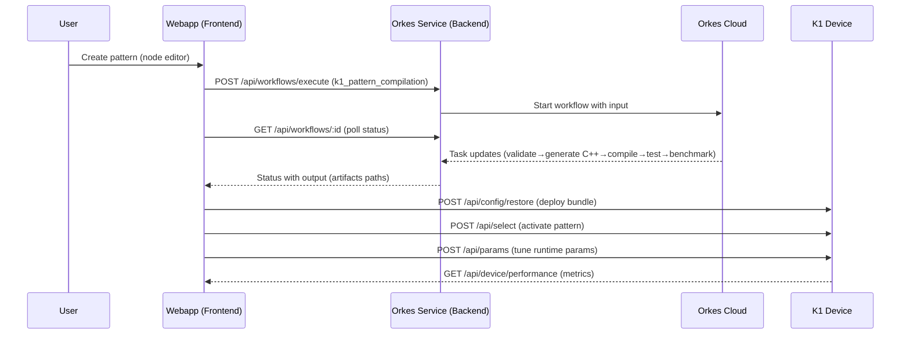
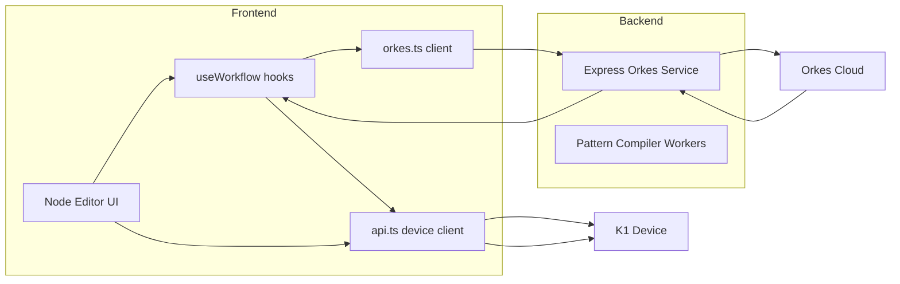

# K1 Webapp Integration: Node System & Orkes Workflow

## Overview
Integrate the node-pattern authoring and compilation flow into the webapp by connecting the frontend to the Orkes workflow service and the device firmware HTTP API. This document captures technical requirements, architecture, data flows, and error handling.

## Technical Requirements
- API endpoints:
  - Orkes Service (workflow orchestration):
    - `POST /api/workflows/execute` — trigger `k1_pattern_compilation`
    - `GET /api/workflows/:workflowId` — poll execution status
    - `POST /api/workflows/:workflowId/pause` — pause workflow
    - `POST /api/workflows/:workflowId/resume` — resume workflow
    - `POST /api/workflows/:workflowId/retry` — retry failed workflow
    - `DELETE /api/workflows/:workflowId` — terminate workflow
    - `GET /api/status` — connectivity/auth status
  - Firmware Device API (per-device):
    - `GET /api/patterns` — list firmware patterns
    - `POST /api/select` — select pattern (by `id` or `index`)
    - `GET/POST /api/params` — get/update runtime parameters
    - `GET /api/palettes` — list available palettes
    - `POST /api/config/restore` — deploy bundle/config to device
    - `GET /api/device/performance` — device performance metrics
    - `GET /api/test-connection` — connectivity check

- Data structures:
  - Pattern Compilation input (to Orkes):
    ```json
    {
      "patternName": "rainbow_pulse",
      "patternCode": "pattern rainbow_pulse { color: red; timing: pulse(0.5s); }",
      "targetDevice": "device-001",
      "optimizationLevel": "O2"
    }
    ```
  - Workflow status response:
    ```json
    {
      "workflowId": "<id>",
      "status": "RUNNING|COMPLETED|FAILED|PAUSED|TERMINATED",
      "input": { /* original input */ },
      "output": { /* compiled binary path, test results, benchmarks */ },
      "tasks": [{ "taskName": "compile_firmware", "status": "COMPLETED" }]
    }
    ```
  - Firmware params payload (subset):
    ```json
    {
      "brightness": 0.8,
      "saturation": 0.7,
      "speed": 0.5,
      "palette_id": 3
    }
    ```

- AuthN/AuthZ:
  - Webapp → Orkes Service: CORS with Allowed Origins, no frontend JWT required for local dev; Orkes client inside service uses env (`ORKES_KEY_ID`, `ORKES_KEY_SECRET`).
  - Webapp → Device: local HTTP endpoints; no auth by default, may require LAN access policy.
  - Future enhancement: add API gateway/JWT for Orkes Service and device proxies.

- Client-side libs/frameworks:
  - React + Vite
  - `@tanstack/react-query` for execution and polling
  - Built-in `fetch`
  - Optional: UI components to visualize workflow tasks/status

## Integration Architecture
- Frontend modules:
  - `src/services/orkes.ts` — Orkes REST client
  - `src/hooks/useWorkflow.ts` — hooks for execute/status/pause/resume/retry
  - `src/lib/api.ts` — existing device firmware client
  - Node editor UI (future): constructs `patternCode` and triggers compilation

- Backend services:
  - Orkes Service: Express REST, connects to Orkes Cloud; runs pattern compiler workers and PlatformIO build.
  - Firmware device: ESP32 HTTP endpoints.

- Data flow:
  1) User designs pattern in the node editor → produces `patternCode`.
  2) Frontend calls `POST /api/workflows/execute` with `k1_pattern_compilation` and input.
  3) Frontend polls `GET /api/workflows/:workflowId` to track progress.
  4) On success, extract `binaryPath` or generated artifacts → deploy bundle to device via `POST /api/config/restore` or select pattern via `POST /api/select`.
  5) Frontend optionally adjusts runtime params via `POST /api/params`.
  6) Monitor device performance via `GET /api/device/performance`.

## Architecture Diagrams

Sequence: Pattern authoring → compilation → deployment



Components



## Error Handling & Fallbacks
- Orkes request errors: show retry/terminate options; maintain last known status in cache.
- Network errors: provide exponential backoff and manual refresh.
- Device POST fallbacks: if CORS preflight fails, send opaque `no-cors` POST (already supported) and surface a “sent but unconfirmed” state.
- Compile failures: parse `run_tests`/`analyze_test_failures` outputs; surface actionable errors.

## UI Integration Points
- Compile button on node editor: triggers `useExecutePatternCompilation` with inputs.
- Status panel: uses `useWorkflowStatus` to display task progression, with pause/resume/retry actions.
- Device selector: choose target device IP for deployment.
- Params panel: binds to `postParams` and handles GET/POST interference gate.
